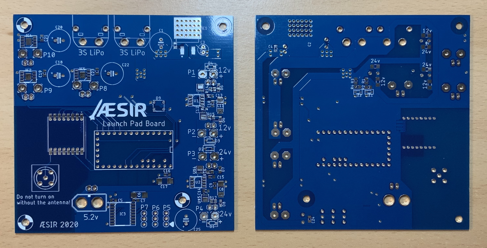

# Hardware description <!-- omit in toc -->

- [Schematic](#schematic)
- [Connectors](#connectors)
  - [Inputs](#inputs)
  - [Outputs](#outputs)
- [Controls](#controls)
  - [Solenoid control](#solenoid-control)
  - [Servo Control](#servo-control)
  - [H-bridge](#h-bridge)
- [Communication](#communication)

The Launchpad Controller is a 100 x 100 mm, 4 layers PCB.

## Schematic

The schematic for the Launchpad Controller can be found in [doc/schematics/schematic.pdf](schematics/schematic.pdf)

## Connectors

### Inputs

- 2x XT60 battery input for 3S LiPos (11.1V nominal). On top of the above picture
- 1x 5V regulated input. Use the USB connector on the microcontroller OR the 5.2V connector at the bottom of the above picture

### Outputs

- 3x JST-XH, 3 pins with PWM signal
- 2x XT30 female @12V ON/OFF
- 2x XT30 female @24V ON/OFF
- 1x XT30 female @12V or @24V, output of an H-bridge (2 more H-bridge outputs can be added)

## Controls

### Solenoid control

- Up to 4 at a time. 2 at 12V and 2 at 24V
- Any solenoid can draw up to 15A

### Servo Control

- Up to 3 at a time
- 6V/0.5A
- 50 Hz PWM signal with adjustable duty cycle

### H-bridge

- Up to 3 outputs at a time
- 12V or 24V. Selectable with a jumper on the bottom side of the PCB

## Communication

A computer can control the Launchpad Controller through the USB Serial interface of the microcontroller or through a LoRa transceiver (RFM9xW). There is a 50Ω RP-SMA connector to connect an antenna